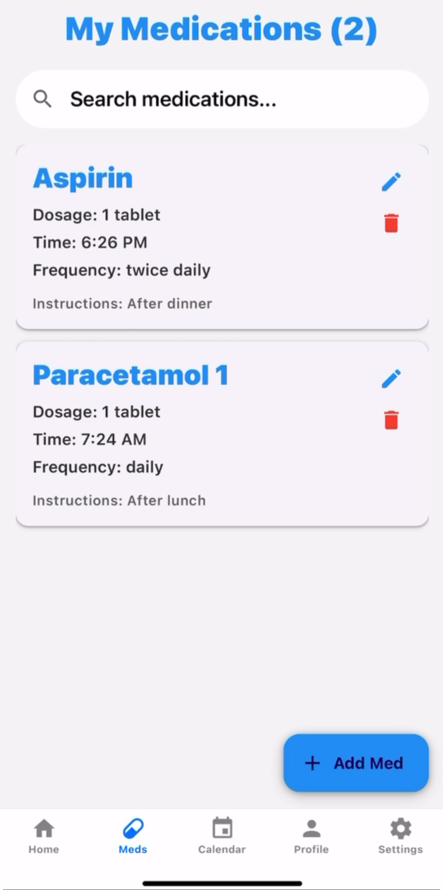
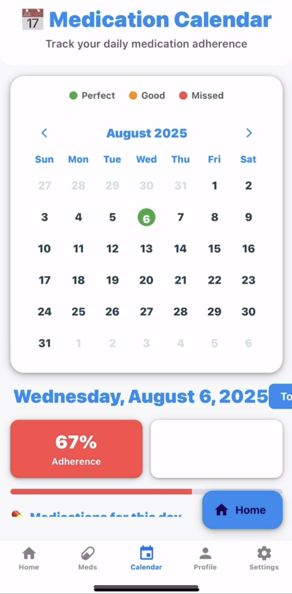
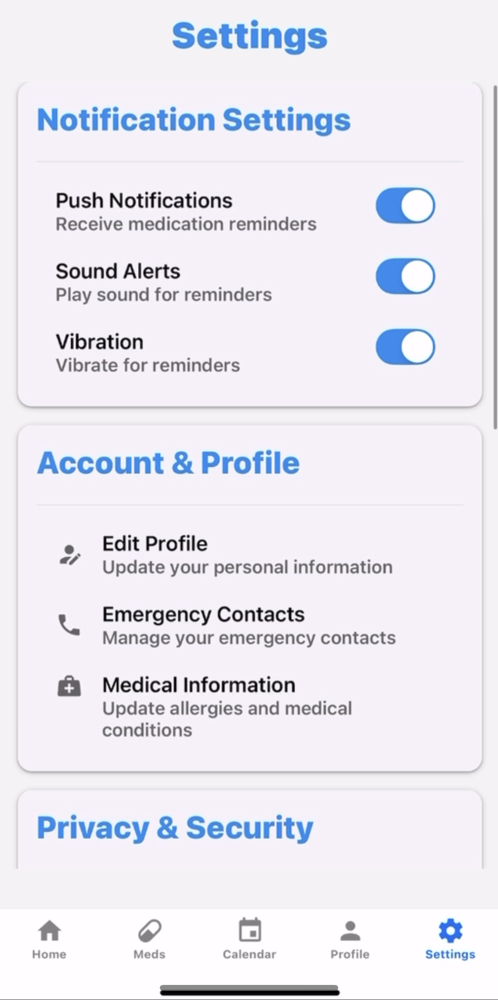

# 📱 PillPal – Smart Medication Assistant (Demo App)

PillPal is a **demo mobile application** built using **Expo (React Native)** to help users track their daily medications with reminders, notifications, camera input, and a clean dashboard UI.  
This project is not production-ready and uses sample/demo data, but it demonstrates **end-to-end mobile app development**, authentication, cloud integration, scheduling, and UI design.

---

## 🚀 Features

### 🔐 Firebase Authentication
- Email + password sign-up and login  
- Secure user account management  

### 📦 Firestore Database
- Store user medications  
- Fetch today's medication schedule  
- Track dose completion  
- Edit/delete medications  

### 🔔 Reminders & Push Notifications
- Scheduled medication reminders  
- Sound + vibration alerts  
- Notification settings screen  

### 📷 Camera Scanning (Demo)
- Camera input for scanning medicine  
- Demo-only placeholder functionality  

### 📊 Dashboard UI
- Today’s Schedule overview  
- Adherence progress  
- Total medications count  
- Colored progress bars  

### 📅 Medication Calendar
- Daily adherence tracking  
- “Perfect / Good / Missed” indicators  
- Shows medications for the selected day  

---

## 🖼️ Screenshots

> Place your screenshots inside a folder named `/screenshots` in the root of your GitHub repo.  
> Use these filenames to match the README.

### 📍 Home / Today’s Schedule  

### 💊 Medications List  

### 📅 Medication Calendar  

### 🔔 Notifications & Settings  

### 👤 Authentication Screen  

---

## 🛠️ Tech Stack

| Category | Technologies |
|---------|--------------|
| Framework | Expo (React Native) |
| Backend | Firebase Authentication, Firestore |
| Notifications | Expo Notifications |
| Camera | Expo Camera |
| UI | React Native Components |
| Platform | Android / iOS |

---

## ⚠️ Demo Disclaimer
This project is a **prototype/demo**, created for learning and portfolio purposes.  
Some features use placeholder data and are not production-ready.

---

## ▶️ How to Run Locally

### 1️⃣ Clone the repository
git clone https://github.com/YOUR_USERNAME/PillPal.git
cd PillPal

### 2️⃣ Install dependencies
npm install

### 3️⃣ Configure Firebase
FIREBASE_API_KEY=xxxx
FIREBASE_AUTH_DOMAIN=xxxx
FIREBASE_PROJECT_ID=xxxx
FIREBASE_STORAGE_BUCKET=xxxx
FIREBASE_MESSAGING_SENDER_ID=xxxx
FIREBASE_APP_ID=xxxx

### 4️⃣ Run the App
npx expo start

Scan the QR code using the Expo Go app.

---

## 🔮 Future Improvements

- OCR-based medicine recognition
- Prescription scanning
- AI-based medicine explanations
- Better medication database
- Dark mode
- Multi-user support
- Refill reminders
- Backup/restore system

---

## 🤝 Contributing

Feel free to fork, open issues, and submit pull requests.
